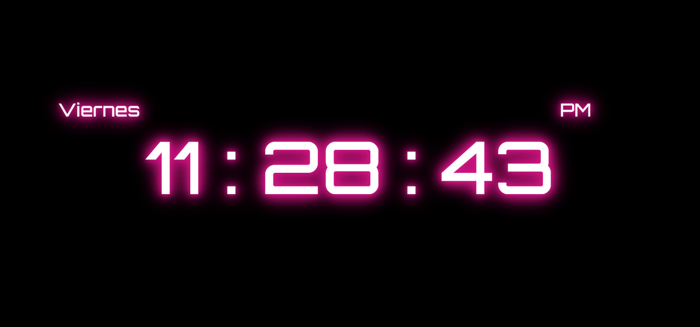

# A digital clock made with HTML, CSS and Javascript

## About the project

This project was built to practice vanilla js and DOM

---

Live: https://luisdgza.github.io/simpleDigitalClock/

### Built with

- HTML
  
- CSS
  - Bootstrap 4